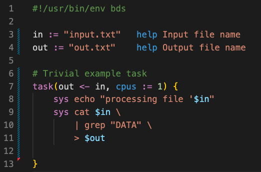

# Syntax highlight 

There are a couple of extentions for syntax highlighting you can use.

- The VIM syntax highlight module for bds can be found [here](https://github.com/serine/bdsSyntaxHighlight)
- The VSCode syntax highlight extension can be found in the [bds repository](https://github.com/pcingola/bds/tree/main/vscode/bds)

### Installing VSCode extension

Copy the [vscode/bds](https://github.com/pcingola/bds/tree/main/vscode/bds) directory from `bds` GitHub repository to VSCode's extensions dir.
This can be simply done like this:
```
cp -rvf vscode/bds $HOME/.vscode/extensions
```

After re-starting VSCode, bds syntax highlight should work when you open any `*.bds` file.


